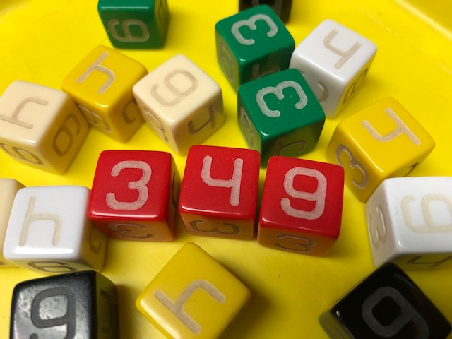
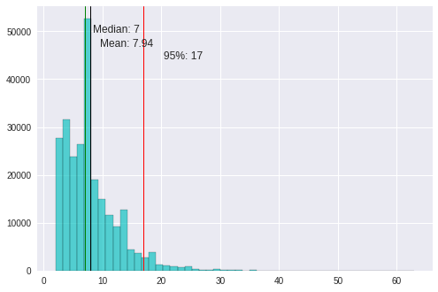

# Troop 349 The Dice Game

## Game Setup

You need the following game components:

* Three (3) _Troop 349_ dice. (these are six sided dice with sides labeled `3`, `3`, `4`, `4`, `9`, `9`)
* Pencil or pen and paper to keep score with, or a good memory.

1. Each player starts with zero (0) points.

2. Choose a starting player by their highest rank in scouting and then the number of years engaged in scouting (an Eagle scout goes before a Life Scout who has also been a scouter for 12 years.)

3. The starting player rolls two (2) of the _Troop 349_ dice to determine the winning point total by arranging the dice.

    _Example_: The player rolls a `3`, and a `4` the winning point total can be either `34` or `43` the player who rolled chooses which combination they want to use.

4. Pass the dice to the next player (clockwise) to start the game

## Game Play

1. The player rolls the dice and adds or subtracts the rolled dice from their point total.

    _Example_: the player rolls `4`, `4`, and `9` so they could add `17` points to their total (`4+4+9`) or `1` point (`9-4-4`) or subtract 1 point (`4+4-9`). The player can add or subtract any combination of the individual dice numbers. The player _must use all the dice_ in their calculation.

2. Pass the dice to the next player (clockwise) and repeat.

## Winning the Game

When a player’s point total is _exactly equal the winning point total_ at the end of their turn, they  win! You may continue to play for 2nd, 3rd, etc. place if there are more than two players.

## Alternate Rules

### Players roll their own win conditions

Each player rolls their own point total at the start of the game rather than one point total for all players. The first player is then selected by the highest winning point total.

### Longer Game

To play a longer game, use three (3) or more dice to determine the game winning point total.

## Game simulation to determine play length

Included in this repository is a Python 3 Jupyter Notebook that will simulate playing the game a number of times and then chart the number of turns needed to reach a win condition. Note that the code only simulates a single player game.

The resulting histogram is shown below. Using this simulaton the average game should be somewhere between 7 and 8 turns (for a single player) with 95% of all games being 17 turns or less.

In an attempt to make this code a bit flexible, the die faces and number of dice used to set the win point total and rolled for each turn are variables and could be changed. This has not been tested extensively! Your results may vary.

You can run this notebook interactively with Binder:

NOTE: For local use in a virtual environment use something like `python3 -m venv venv; source venv/bin/activate; pip install -r requirements.txt`

## Notes on making your own version

Included in this repository is [Troop349-Dice-Game.svg](Troop349-Dice-Game.svg) which contains the appropriate designs for laser cutting on a laser cutter. I use the most excellent [K40 Whisperer](https://www.scorchworks.com/K40whisperer/k40whisperer.html) from [@Scorchworks](https://www.scorchworks.com). Feel free to check out my [macOS packaging of K40 Whisperer](https://github.com/stephenhouser/k40-whisperer) if you are a Mac user.

* Not all die-face combinations will work! That is, if you use `2` on all faces, you cannot get any odd numbers! The good news is that you won't have to as your winning point total will always be an even number too.

* `349` is prime. While that's cool, it doesn't do anything special for the game. Other than its cool factor.

## License

 This work is licensed under a <a rel="license" href="http://creativecommons.org/licenses/by-nc-sa/4.0/">Creative Commons Attribution-NonCommercial-ShareAlike 4.0 International License</a>.